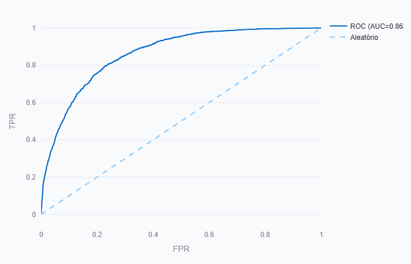
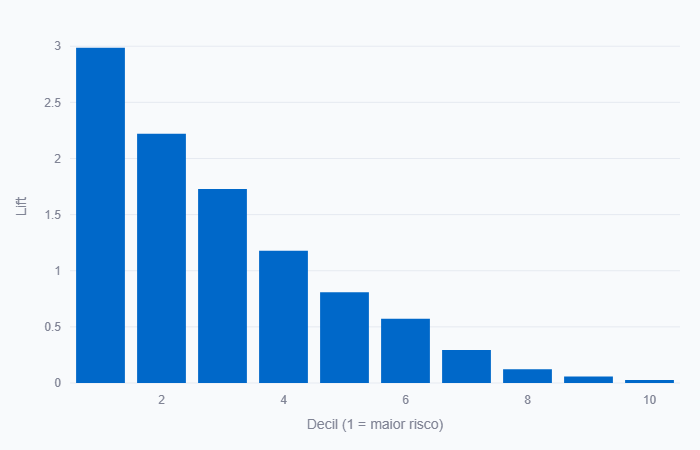
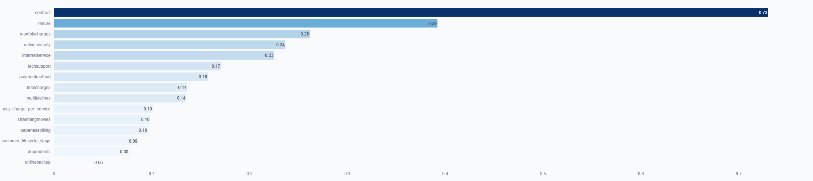

# 📉 Previsão de Churn com Machine Learning

Projeto de Data Science desenvolvido para prever cancelamento de clientes (churn) e apoiar estratégias de retenção orientadas a impacto financeiro.

O objetivo não é apenas prever churn, mas **priorizar clientes com maior risco**, permitindo decisões comerciais mais eficientes e maximizando ROI em campanhas de retenção.

---

# 🎯 Problema de Negócio

Empresas com modelo de receita recorrente sofrem com evasão de clientes.  
Sem priorização adequada, campanhas de retenção:

- Contatam clientes de baixo risco
- Desperdiçam orçamento comercial
- Reduzem eficiência operacional

Este projeto propõe um modelo preditivo capaz de:

- Identificar clientes com maior probabilidade de cancelamento
- Priorizar ações comerciais
- Estimar impacto financeiro da retenção

---

# 🧠 Abordagem Técnica

## 🔹 Tratamento de Dados
- Limpeza e padronização
- Encoding de variáveis categóricas
- Tratamento de desbalanceamento (`scale_pos_weight`)
- Engenharia de features
- Separação treino/teste

## 🔹 Modelagem
- Modelo principal: **XGBoost**
- Validação cruzada
- Ajuste de hiperparâmetros
- Avaliação com métricas de classificação

## 🔹 Métricas Avaliadas
- AUC-ROC
- Precision
- Recall
- F1-Score
- Matriz de Confusão
- Análise de Lift e eficiência de priorização

### ROC CURVE



A curva ROC demonstra a capacidade de separação entre churners e não churners.

---

### Lift Chart


Observa-se forte concentração de churners nos decis superiores, permitindo priorização estratégica.

---

### Feature Importance


As variáveis mais relevantes indicam os principais drivers de cancelamento.

---

# 📊 Exemplo de Impacto Financeiro

### Cenário Simulado:

- 10.000 clientes
- 20% de churn (2.000 clientes)
- Ticket médio mensal: R$200

### Receita anual em risco:

2.000 clientes × R$200 × 12 meses = **R$4.800.000**

Se 30% dos churners forem retidos:

- 600 clientes recuperados
- 600 × R$200 × 12 = **R$1.440.000 preservados por ano**

📌 O modelo permite direcionar ações comerciais para maximizar essa recuperação com menor custo operacional.

---

# 💻 Aplicação Interativa

O projeto inclui uma aplicação desenvolvida com **Streamlit**, permitindo:

- Inserção de dados individuais de clientes
- Cálculo da probabilidade de churn em tempo real
- Visualização de risco
- Apoio à decisão comercial

### Para rodar localmente:

```bash
pip install -r requirements.txt
streamlit run app.py
```

---

# 📂 Estrutura do Projeto
previsao-churn/
│
├── data/               # Base de dados
├── models/             # Modelos treinados
├── notebooks/          # Análises exploratórias
├── src/                # Funções e pipeline
├── app.py              # Aplicação Streamlit
├── requirements.txt    # Dependências
└── README.md

# 🛠 Tecnologias Utilizadas

• Python

• Pandas

• NumPy

• Scikit-learn

• XGBoost

• Streamlit

• Matplotlib

• Seaborn

---

# 🔍 Diferenciais do Projeto

• Foco em impacto financeiro e não apenas métrica técnica

• Tratamento de desbalanceamento de classes

• Simulação de priorização comercial

• Aplicação interativa para tomada de decisão

• Estrutura organizada para produção

---

# 📌 Conclusão

Este projeto demonstra a aplicação prática de Machine Learning orientado a resultado financeiro, conectando modelagem preditiva à estratégia de negócio.
Mais do que prever churn, a solução permite priorizar clientes de maior risco e transformar dados em decisões acionáveis.